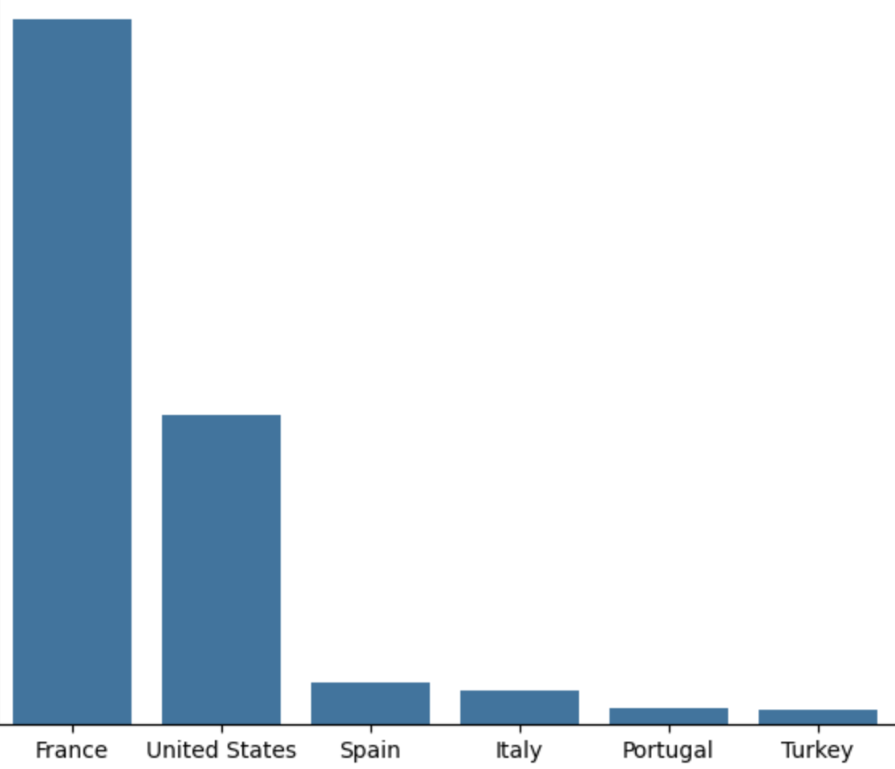

# radar-challenge

This repository contains the solution to the Radar Technical Challenge. The project focuses on:

- **Data Visualization**: Only a small subset of insights is used leaving potential for further extension.
- **Machine Learning**: PCA for 3D embedding and visualizing customer segments.
- **Web Application Deployment**: A Streamlit-based web app has been deployed and is accessible [here](https://example-streamlit-app-link.com).

Example of the project output:

